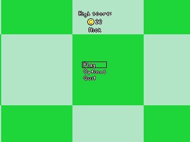
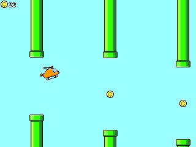
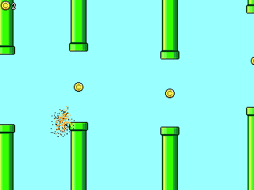

# Kero Game Framework

This is Nick Walton's game backend framework. I created and am using this to program small games from scratch for Windows, Linux and MacOS (aspiring to support console platforms in future).


## Warning

**Do not just download this and expect to start making games right away.** This is not a set-and-forget, production-ready framework like SDL or Raylib. I have released this into the public domain for educational purposes and the public good. I hope this will be useful to the public as a learning resource and starting point for doing one's own from-scratch programming. This is not intended to be a standard programming library.

## Building

Most of this is written in GNUC23, so you need a recent version of GCC. On MacOS, the sound and osinterface libraries are written in Objective-C, and require Clang.

### Windows

Prerequisites

- A recent version of GCC which supports GNUC23
- OpenGL
- CMake

These are included in the MinGW package from Winlibs, which can be installed with Windows' built-in package manager, winget, with the following command:

```
winget install BrechtSanders.WinLibs.POSIX.UCRT
```


Clone this repository. Open a terminal inside the respository folder. Type the following commands:

```
mkdir build
cd build
cmake ..
cmake --build build
./build/a.exe
```


### Linux

Prerequisites

- GCC
- CMake
- OpenGL

These should be installable through your system's package manager. Please search the web for a guide on installing them for your specific distribution.

Clone this repository. Open a terminal inside the repository folder.

```
mkdir build
cd build
cmake ..
cd ..
cmake --build build
./build/a
```


### MacOS

Prerequisites

- GCC
- CMake
- XCode Command Line Tools

You can install GCC and CMake through Homebrew. See https://brew.sh/ for more information. XCode Command Line Tools can be installed by typing this in a terminal:

```
xcode-select --install
```


Clone this repository. Open a terminal inside the repository folder.

```
mkdir build
cd build
CC=gcc-15 OBJC=clang cmake ..
cd ..
cmake --build build
./build/a
```

You may have trouble with the line,

```
CC=gcc-15 OBJC=clang cmake ..
```

Apple redirects gcc to clang, but to build this code you actually need to use GCC for all the non-Objective-C stuff. Depending on the version of GCC you installed with brew, you should be able to call it as gcc-VERSION, where VERSION is the version of GCC you have installed. At time of writing, gcc-15 is current.

### Release builds

Modify the below build instructions based on your operating system, as shown above.

```
mkdir build-release
cd build-release
cmake .. -DCMAKE_BUILD_TYPE=MinSizeRel
cd ..
cmake --build build-release
./build-release/a
```


# Architecture

## Framework architecture

This framework is multi-threaded, with 4 threads for:

- Operating system events
- Sound
- Rendering
- Logic

The main thread initializes the window, logging, etc., starts the other 3 threads, then enters an event loop which it will continue until the program shuts down. The other threads have their own initializations, then monitor a "quit" variable controlled by the main thread while they perform their functions.

The sound and rendering threads use command buffer architectures - the game code calls functions like SoundFXPlay() and Render_Sprite() to add commands to their buffers, which they will carry out in their next loop iteration.

The rendering thread determines the monitor refresh rate, then locks to that rate. Every loop, it selects the latest complete "render state" buffer which contains the latest complete game frame's rendering commands and executes all the commands to produce a frame.

There are 3 "render state" buffers. To draw each frame, the rendering thread acquires a mutex over the buffers, checks all 3 to find the newest completed buffer, marks that buffer as in-use and releases the mutex. At the end of rendering it marks the buffer as unused.

The sound thread is more integrated with the OS, but overall it:

- Waits for a callback from the native OS sound library.
- Gives the OS 5ms of prepared, compressed sound samples.
- Executes any available commands.
- Refills the previously used sample buffer with 5ms of uncompressed samples.
- Compresses the other 5ms sample buffer.
- Repeat.

Compression is done with a 5ms lookahead compression algorithm, using the greatest sample magnitude of the current and next buffer. The greater value is lerped toward over a 5ms period, and always reached before compression of the buffer containing the peak value begins compression.

The logic thread runs at a fixed 120Hz. It takes input events from a ring buffer filled by the main thread and maintains its own arrays for frame-by-frame inputs which make more sense than events in game logic. It has a "state" variable which is an enum defined by the game code. Every frame it checks if the state has changed, in which case it runs the state's Init() function, then either way it runs the state's Update() function.

The framework requires you to provide the file, game_exports.h, which sets some #defines like internal resolution and the game title, and exports the state enum and an array of their Init() and Update() functions.

## Memory architecture

There are no dynamic memory allocations in the entire framework. Everything the framework internally requires is statically allocated inside the appropriate translation unit. This removes a significant amount of potential failures, reduces code complexity and reduces memory redirection. It avoids the mess of either having the framework internally allocate memory or passing memory/allocators from the game to the framework and back.

The provided example game, Flappy Choppa, is also architected with no memory allocations, to remove potential failure-points and reduce code complexity.

## Game architecture

The game code is built in its own translation unit(s). You must implement anything exported from game_exports.h, such as the state_functions[] array. Other than that, you're relatively free to architect your game however you want. You could just have 1 state with an Init() and Update() and handle your game's state internally. I like to build each state as a separate translation unit, so my "game/" source code directory consists of:

```
game.c
game.h
game_exports.h
game_menu.c
gameplay.c
```

"game.h" exports things that multiple game states need access to. "game.c" implements everything exported by either game.h or game_exports.h, along with handling initialization of a few things before switching the state to the menu. The two states in this game - menu and gameplay - are fully implemented in their own self-contained .c file.

Included in this repository is a simple "Flappy Bird" clone, called "Flappy Choppa", which serves as an example and proof-of-concept.

  

## File loading

User configuration and save data are dynamically loaded from and saved to files in the appropriate directories based on the user's OS. However, all game assets are compiled into the binary. This removes a huge class of failures, and allows for the game to be distributed as a single file. Of course, this wouldn't be practical for a AAA game, but 2D, retro-style games may not have more than a few megabytes of assets at the high end, so the cost for this benefit is minimal. This also results in practically instant "loading", since nothing actually needs to be loaded.


## Why I made this framework 

When programming games in the past, I've listened to the advice, "Don't reinvent the wheel," and, "You probably can't do it better than X, so just use X." This advice is intended to save people time and get straight to productive game programming, but I found it difficult to become a good enough programmer while skipping so many foundational parts of the code. I ran into bugs and issues which required understanding the underlying code, which was very difficult when I'd never written code as low-level as the libraries/engines I depended on. I also felt demotivated working on games that I ultimately may be unable to maintain - like the multitude of fantastic Flash-based games from back in the day. I finally decided to build my games from the ground up and created this framework. Now I've completed my first game (launching on Steam soon), and have become a much better and faster programmer. It was not easy to get this far, and I've encountered a significant lack of resources on how to write this kind of code, so I'm putting this in the public domain as an example for others to get over some early hurdles.

Relevant background: Between 2015-2019 I published 5 games, made in Godot, PICO-8, and C (relying on various libraries). I've also made several unpublished prototypes in GameMaker Studio, Love2D (Lua), Unity, Unreal, and more.

## Work in progress

This code is not finished or final. I have completed a game with it, so it's functional, but it is not significantly field-tested. Expect some code-paths to be non-functional if they're not used in one of my games. The API is not locked. I intend to fix any bugs that people encounter when running my games built with this framework, and add features to it such as key rebinding, controller support and whatever else my future games require.